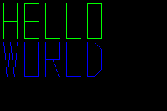

# GBA Hello World

Simple hello world program that draws letters on the screen in graphic mode 3.

The main goal is to test the toolchain and test simple pixel-based graphics.

## Build

To build
```console
make
```

The project is built with Clang and linked with LLD. After build, the ROM is patched with [gbafix](https://github.com/rust-console/gbafix).

The final target is the file `hello.gba`.

To clean up
```console
make clean
```

## Output

If the build succeeds, `hello.gba` can be run in a GBA emulator (or on real hardware) and should show the following after boot:


